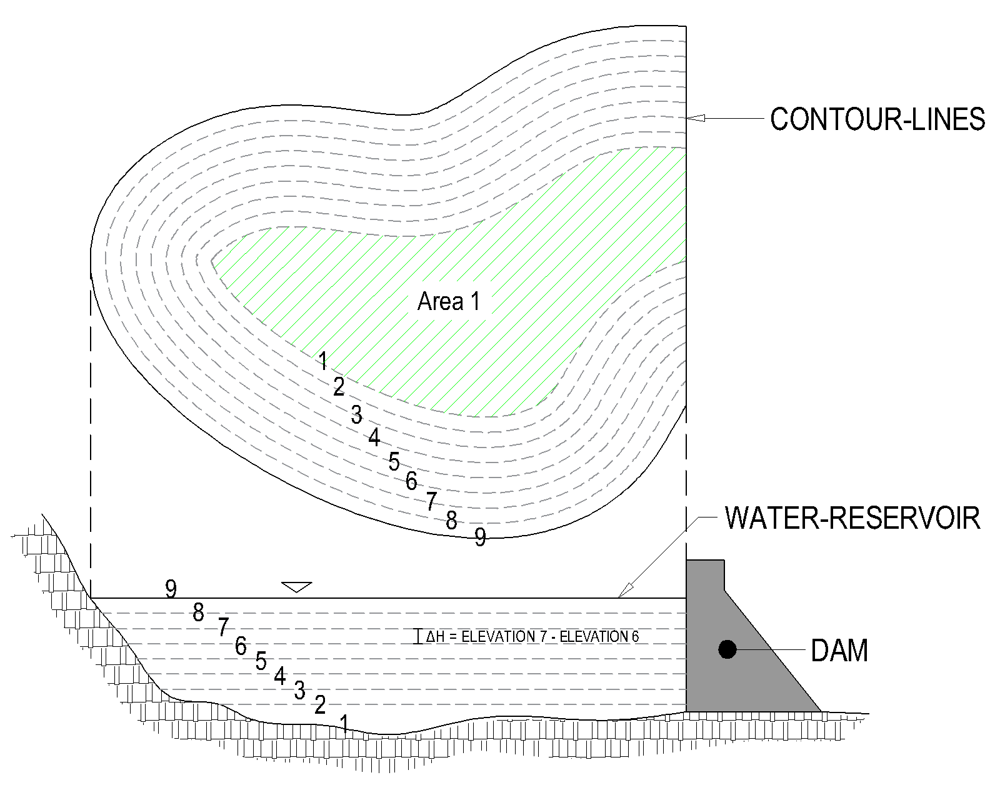
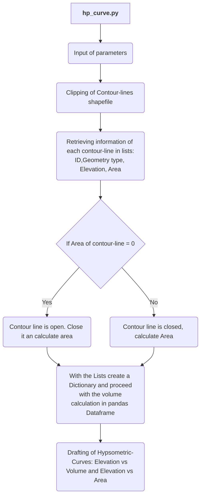
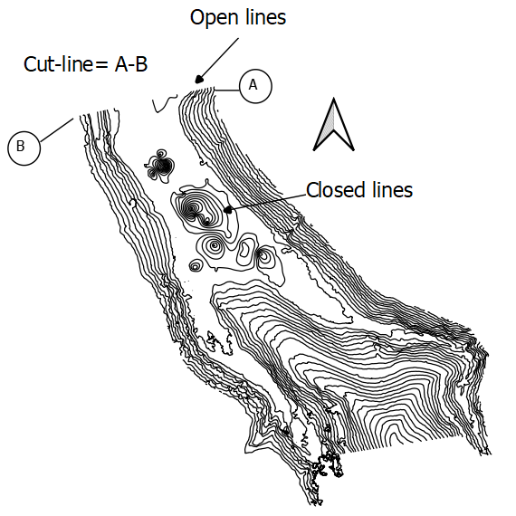
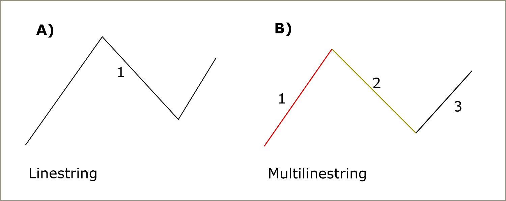
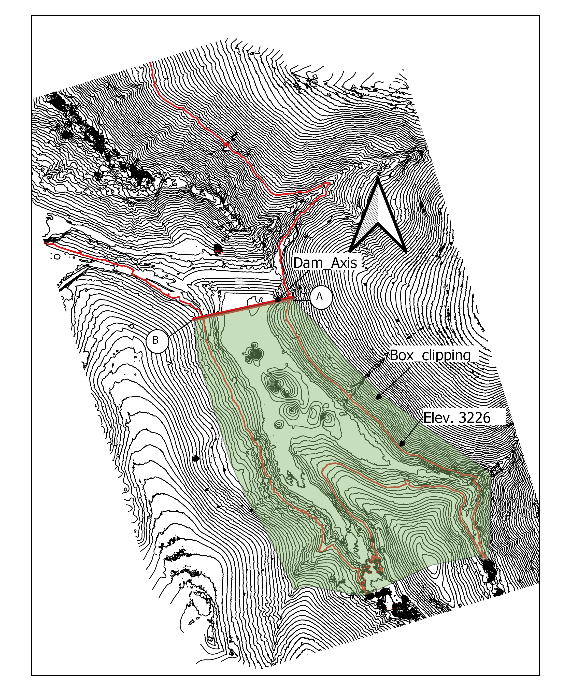
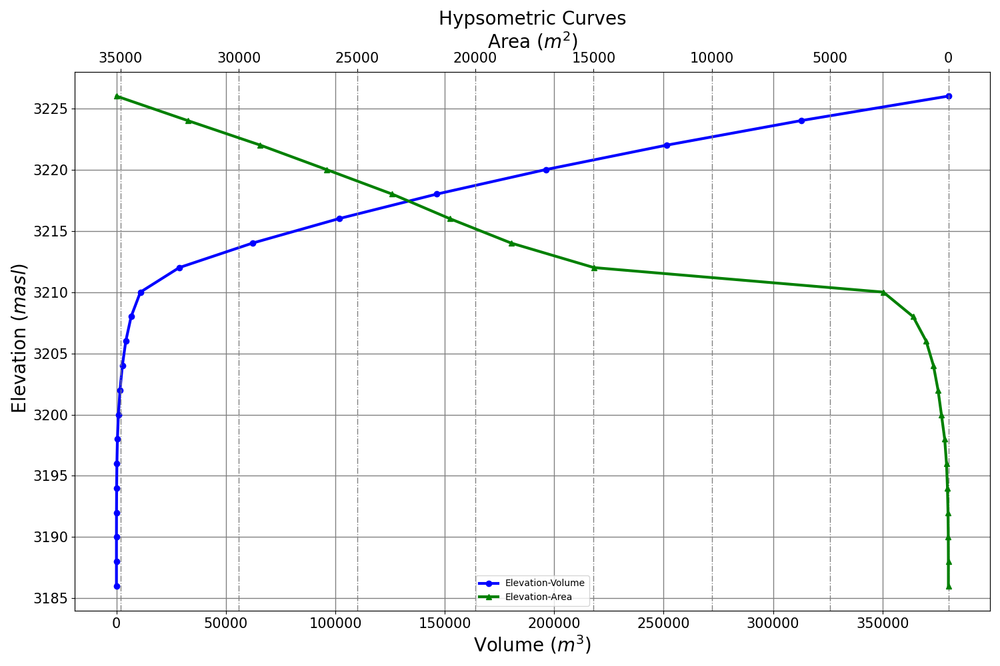

# Water-reservoir
***
## Volume calculation - Hypsometric curves
_Written by Diego Beramendi Ortega_

_Stuttgart-Germany 28.05.2022_

<hr style="border:2px solid gray">

## 1. Introduction
The function `hp_curv.py` computes the volume of a water-reservoir respect a dam axis  based on a contour-line Shapefile and a boundary polygon
which is also used to clip the contour-line Shapefile. The total volume is calculated as 
the accumulated value of volumes corresponding to a certain elevation difference. **Method 2** (Explained below) is used
for this end. 


**Fig.1** - A Dam in Elan Valley in Mid Wales. Source :  Marcus Woodbridge,2019.

Information of the contour-lines is retrieved and disposed in Dataframe for the calculation and subsequently
drafting of the hypsometric curves of the water-reservoir. 

## 2. Hypsometric-curves 

Hypsometric curves provide two types of information of a particular water reservoir: the
stored volume at a certain elevation, given by the relation Volume-Elevation 
and the corresponding water-mirror area; therefore, information on its morphology can be infered. 

There are 3 known methods to draft the hypsomestric curves and determine the volume of a Water 
reservoir in an approximate way [[1]](#1), though due to the technologic advances and studies in this regard more sophisticated 
methods may have been developed. 


### 2.1 Method 1

The volume of a water-reservoir is obtained from the accumulated value
of volumes that are calculated in successive layers with the formula of a circular cone [[1]](#1). 


$$ 
V = \frac{1}{3}H(A_{1}+A_{2} + \sqrt{A_{1}*A_{2}})
$$

Where: 

$V$ : Volume.

$A_{1}$ : Area within the outer depth contour being considered.

$A_{2}$ : Area within the inner contour line under consideration.

$H$     : Difference of elevation between the considered contour lines.

### 2.2 Method 2




**Fig.2** - Contour-lines of a water-reservoir. Source: Beramendi,2022.

This formula is derived from the "End-Area formula" that is applied to
calculate the volume of prismoidal forms [[1]](#1): 

$$V = \frac{1}{2}H(A_{1}+A_{2}) $$

Where: 

$V$ : Volume.

$A_{1}$ : Area within the outer depth contour being considered.

$A_{2}$ : Area within the inner contour line under consideration.

$H$     : Difference of elevation between the considered contour lines.


### 2.3 Method 3

This method consists of multiplying average lake depth by lake area. 
The average depth is obtained by averaging depth soundings uniformly 
spaced in a grid pattern. This method has as a drawback the omission of 
depth soundings for very shallow water which leads to errors [[1]](#1). 


The method used in `hp_curve.py` is the Method 2. The precision of the calculation depends on the density
of contour-lines, a more dense contour-lines (e.g. each 1 meter) implies a larger precision than sparse
contour lines (e.g each 5 meters).

# 3 Code 
## 3.1 Diagram 




## 3.2 Code development 

The first section of the code clips the contour-lines Shapefile and declares the variables 
`geomerged` and `geotype` as **global** making possible their usage outside the if block 
`if geometry_elements != 0:`.

```python
global geo_merged, geo_type
os.system('ogr2ogr -clipsrc' + ' ' + dst_file_name + ' ' + curve_name + ' ' + file_name)
```

In order to manipulate the content of the Shapefile the appropriate *Driver* (*Shapefile*) is indicated and then the
is opened with `diver.Open(<file_name>,<update>)` where `<update> = 0` for read only and `<update> = 1`
for writing [[2]](#2).

```python
driver = ogr.GetDriverByName('ESRI Shapefile')
data_source = driver.Open(curve_name, 0)
```

The layer of the Shapefile is accessed with `layer = data_source.GetLayer(<index>)` where `<index>` is always
0 for Shapefiles. This value is more valuable for other data types such us GML or TIGER [[2]](#2). The number of elements
contained in the Shapefile is obtained with `layer.GetFeatureCount()`.


```Python

layer = data_source.GetLayer(0)
num_elements = layer.GetFeatureCount()

```

Empty lists are created to store retrieved information of each contour-line through a for loop namely:

* ID
* Number of elements 
* Geometry type
* Elevation 
* Area of each contour-line

```python
id_list = []
elements_list = []
geometry_list = []
elevation_list = []
area_list = []
```

With a *for loop* both, the *ID* is retrieved as well as the *Elevation* value of each element that is compared to the `ref_level`. If the value meets
the decision parameter criteria, the **geometry** of the element, its **name** and **number of sub-elements** is obtained with `feature.GetGeometryReg()`, `geometry.GetGeometryName()` 
and `geometry.GetGeometryCount()` respectively. 

`ref_level` fixes the upper limit of the considered water-reservoir. Contour-lines whose elevation are higher than
this value will not be considered for the volume calculation. 

```python
   for i in range(0, num_elements):

        feature = layer.GetNextFeature()

        # Getting the id and elevation of every contour line
        id = feature.GetField('ID')
        elevation = feature.GetField('ELEV')

        if elevation <= ref_level:

            geometry = feature.GetGeometryRef()
            # Displaying the type of geometry
            type_geometry = geometry.GetGeometryName()
            geometry_elements = geometry.GetGeometryCount()

```
The contour-lines Shapefile is composed by two groups of lines: **closed lines** and **open lines**
which have **Area = 0** as a consequence of the clipping procurement. They must
be closed in order to get its area, for this purpose **Shapely** was used. Figure 
shows both lines as a result of clipping. 




**Fig.3**. Clipped contour-lines. Open and closed lines. Source: Beramendi, 2022. 

The *Geometry Type* of the lines can be
either a **Multilinestring**, which are geometries composed of several lines (linestrings), or a  **Linestring** which is only one line like
showed in the figure below.



**Fig.4** - Linestring and Multilinestring. Source: Beramendi,2022.


The open lines are first identified with `if geometry.GetArea()==0` then
its geometry are exported into *Well Known Text format (WKT)* and loaded to enable operations with **Shapely**.

if the contour-line is Multilinestring (composed of several lines) `geometry_elements!=0` is true, then it is merged with `linemerge(load_geom)` and their
coordinates (of the merged open line) are retrieved with `list(merged_geometry.coords)` and used to create a Polygon 
with `Polygon(coordinates_linestrings)` so to calculate its area with `polygon.area`.

if the contour-line is a Linestring then its coordinates are extracted to create a polygon and get its area: 
`merged_geometry=load_geom`.

For tracking reasons the number of elements of the open lines are computed before and after the 
merging. Naturally, after the merging the results is always 1. 

The retrieved information is stored in the before created lists. 

if `geometry.GetArea()` is not zero it means that the line was not affected by the clipping procurement. Therefore the 
value from (`geometry.GetArea()`) as well as the other values (id, elevation, geometry type etc) are stored in the
lists.

```python
            if geometry.GetArea() == 0:

                # The geometry is converted to Well Known Text(WKT) format
                geom_wkt = geometry.ExportToWkt()
                # From this section Shapely is used
                # The WKT geometry has to be loaded to enable operations with Shapely
                load_geom = wkt.loads(geom_wkt)
                # The components of the Multilinestring are merged to create linestrings
                if geometry_elements != 0:
                    merged_geometry = linemerge(load_geom)
                    # geo_merged gives the number of elements before merging
                    geo_merged = len(load_geom.geoms)
                    # geo_type gives the type of geometry after merging
                    geo_type = merged_geometry.geom_type

                else:
                    merged_geometry = load_geom

                # Retrieving the coordinates of the linestrings
                coordinates_linestrings = list(merged_geometry.coords)

                # Creation of a Polygon
                polygon = Polygon(coordinates_linestrings)

                # Area calculation of the above created polygon
                area_polygon = polygon.area

                # Storage of data into the lists
                id_list.append(id)
                elements_list.append(geo_merged)
                geometry_list.append(geo_type)
                elevation_list.append(elevation)
                area_list.append(area_polygon)

            else:
                id_list.append(id)
                elements_list.append(geometry_elements)
                geometry_list.append(type_geometry)
                elevation_list.append(elevation)
                area_list.append(geometry.GetArea()) 
```
Once all the information from the contour lines are stored in their correspondent lists a dictionary
with that information is created to be used in a Dataframe  for the arithmetic calculation 
of the water-reservoir volume. The information is order with respect the elevation in ascending order. 


```python
   # Creation of a Pandas Dataframe

    dict = {'ID': id_list, '# Elements': elements_list, 'Geometry': geometry_list, 'Elevation': elevation_list,
            'Area': area_list}
    # Sorting of data with respect elevation in ascended form
    dt = pd.DataFrame(dict).sort_values(by=['Elevation'], ascending=True)
    print(dt)


```

It may exist contour-lines with the same elevation but independent geometry, in such a case their areas are summed up
but the elevation is kept. 


```python
   # Verify if there are duplicates elevation values, if so their areas are summed up
    dt_proc = dt.groupby(['Elevation'], as_index=False)['Area'].sum()
    print(dt_proc)
```

Proceding with the calculation, 4 colums are created and alocated at the right side of the Dataframe, those are:

1. `Diff_Elevation` - Calculates the difference of elevation between contour-lines.
2. `Avr_Area` - Calculates the average area between two contour-line areas. The `.shift()` is used to sum one value of a column with the above one. 
3. `Volume` - Calculates the Volume which is give by the multiplication of 1 and 2.
4. `Ac_Volume` - Is the accumulated volume whose final value is the total volume of the water-reservoir. 


```python
# Calculation of the Reservoir volume

dt_proc['Diff_Elevation'] = dt_proc['Elevation'].diff()
dt_proc['Avr_Area'] = (dt_proc['Area'] + dt_proc['Area'].shift()) / 2
dt_proc['Volume'] = dt_proc['Diff_Elevation'] * dt_proc['Avr_Area']
dt_proc['Ac_Volume'] = dt_proc['Volume'].cumsum()

```


# 4. Example 

Given a Digital Elevation Model (DEM) **./dem.tif** of a particular area, calculate the volume of water-reservoir
respect the red dam axis, which goes from point A to Point B, at a maximum elevation of 3226 masl with contour-lines 
every 2 m. See Figure below.


**Fig.5** - Digital Elevation Model, Dam axis and Dam-axis. Source: Beramendi, 2022. 

First, the contour-lines Shapefile every 2 m are generated in QGIS (**contourlines_2m.shp**) and the contour-line with an elevation of 3226 masl
is identified and red colored. Subsequently the Box_clipping polygon(**Box_clipping.shp**) is delineated containing the contour
lines under consideration. It must be noted that this polygon must have 2 vertices at the dam axis, that is to 
say at Point A and Point B. 



**Fig. 6** - Contour-lines every 2 meters, dam Axis and boundary polygon. Source: Beramendi, 2022.

The function is called in the following way: 

```python
hyp_curve(file_name, dst_file_name, curve_name, ref_level, to_excel=True, save_png=True)
```

* file_name = ./contourlines_2m.shp
* dst_file_name = ./Box_clipping.shp
* curve_name = ./contourlines_2m_clipped.shp
* ref_level = 3226

```python
hyp_curve(contourlines_2m.shp,Box_clipping.shp, contourlines_2m_clipped.shp, 3226)
```

The function will generate the hypsometric curves and will export the dataframe to an excel file called 
`Hyp_curves.xlsx`, See Table 1. Additionally the hypsometric curves will be saved as .png image under the name of 
`Hyp_graph.png`

**Table 1** - Computation of water-reservoir volume. Source: Beramendi, 2022. 

| Index | Elevation | Area            |  Diff_Elevation  | Avr_Area    | Volume      | Ac_Volume       |
|-------|-----------|-----------------|:----------------:|-------------|-------------|-----------------|
| 0     | 3186      | 0.123462873     |                  |             |             | 0               |
| 1     | 3188      | 0.493993795     |        2         | 0.308728334 | 0.617456668 | 0.617456668     |
| 2     | 3190      | 4.307648737     |        2         | 2.400821266 | 4.801642532 | 5.4190992       |
| 3     | 3192      | 16.82696866     |        2         | 10.5673087  | 21.13461739 | 26.55371659     |
| 4     | 3194      | 39.81678544     |        2         | 28.32187705 | 56.6437541  | 83.19747069     |
| 5     | 3196      | 80.3960878      |        2         | 60.10643662 | 120.2128732 | 203.4103439     |
| 6     | 3198      | 156.6652905     |        2         | 118.5306891 | 237.0613783 | 440.4717222     |
| 7     | 3200      | 295.574246      |        2         | 226.1197683 | 452.2395365 | 892.7112587     |
| 8     | 3202      | 437.5920065     |        2         | 366.5831263 | 733.1662526 | 1625.877511     |
| 9     | 3204      | 632.1873158     |        2         | 534.8896612 | 1069.779322 | 2695.656834     |
| 10    | 3206      | 940.2264217     |        2         | 786.2068687 | 1572.413737 | 4268.070571     |
| 11    | 3208      | 1492.546128     |        2         | 1216.386275 | 2432.772549 | 6700.843121     |
| 12    | 3210      | 2753.782069     |        2         | 2123.164099 | 4246.328197 | 10947.17132     |
| 13    | 3212      | 14984.84993     |        2         | 8869.316    | 17738.632   | 28685.80332     |
| 14    | 3214      | 18483.45249     |        2         | 16734.15121 | 33468.30242 | 62154.10574     |
| 15    | 3216      | 21086.18678     |        2         | 19784.81963 | 39569.63927 | 101723.745      |
| 16    | 3218      | 23517.10713     |        2         | 22301.64695 | 44603.29391 | 146327.0389     |
| 17    | 3220      | 26289.77613     |        2         | 24903.44163 | 49806.88325 | 196133.9222     |
| 18    | 3222      | 29099.07854     |        2         | 27694.42733 | 55388.85466 | 251522.7768     |
| 19    | 3224      | 32159.45105     |        2         | 30629.26479 | 61258.52958 | 312781.3064     |
| 20    | **3226**  | **35175.56006** |        2         | 33667.50555 | 67335.01111 | **380116.3175** |

In Table 1 *Diff_Elevation* stands for the **Elevation difference between contour lines**, *Avr_Area* stands for 
the **average Area between contour-lines** and *Ac_Volume* stands for the **acumulation of volumes**. The last
value of the acumulated volumes is the final volume of the water-reservoir at the indicated elevation. 

Figure 7 shows the hypsometric curves of the water-reservoir.  



**Fig.7** - Hypsometric curves of the water-reservoir. Source: Beramendi, 2022.

The total volume of the water-reservoir is displayed in the command window like below:


```
[21 rows x 6 columns]
Total Volume = 380116.32 at elevation 3226
Water-mirror area = 35175.56

```
>**_NOTE:_**  *" Warning 1: OGR_G_Area() called against non-surface geometry type"* will be displayed
> in the command window. This warning refers to open lines with 0 value area since
> they are open, so this warning do not signify any issue that compromises the operation of the function 

The output in the command window will look like this:

```
Number of elements:   140
Warning 1: OGR_G_Area() called against non-surface geometry type.
Warning 1: OGR_G_Area() called against non-surface geometry type.
Warning 1: OGR_G_Area() called against non-surface geometry type.
Warning 1: OGR_G_Area() called against non-surface geometry type.
Warning 1: OGR_G_Area() called against non-surface geometry type.
Warning 1: OGR_G_Area() called against non-surface geometry type.
Warning 1: OGR_G_Area() called against non-surface geometry type.
    Elevation          Area  ...        Volume      Ac_Volume
0      3186.0      0.123463  ...           NaN       0.000000
1      3188.0      0.493994  ...      0.617457       0.617457
2      3190.0      4.307649  ...      4.801643       5.419099
3      3192.0     16.826969  ...     21.134617      26.553717
4      3194.0     39.816785  ...     56.643754      83.197471
5      3196.0     80.396088  ...    120.212873     203.410344
6      3198.0    156.665290  ...    237.061378     440.471722
7      3200.0    295.574246  ...    452.239537     892.711259
8      3202.0    437.592007  ...    733.166253    1625.877511
9      3204.0    632.187316  ...   1069.779322    2695.656834
10     3206.0    940.226422  ...   1572.413737    4268.070571
11     3208.0   1492.546128  ...   2432.772549    6700.843121
12     3210.0   2753.782069  ...   4246.328197   10947.171318
13     3212.0  14984.849930  ...  17738.631999   28685.803317
14     3214.0  18483.452488  ...  33468.302418   62154.105735
15     3216.0  21086.186779  ...  39569.639267  101723.745002
16     3218.0  23517.107128  ...  44603.293906  146327.038908
17     3220.0  26289.776127  ...  49806.883255  196133.922162
18     3222.0  29099.078538  ...  55388.854665  251522.776827
19     3224.0  32159.451046  ...  61258.529584  312781.306411
20     3226.0  35175.560061  ...  67335.011108  380116.317519

[21 rows x 6 columns]
Total Volume = 380116.32 at elevation 3226
Water-mirror area = 35175.56

Process finished with exit code 0
```

# 5. References 

<a id=1>[1]</a>
Taube, Clerence M.2000. Instructions for winter lake mapping.
Chapter 12 in Schneider, James C.(ed.) 2000. Manual  of fisheries
survey methods II: with periodic updates. Michigan Department of
Natural Resources, Fisheries Special Report 25, Ann Arbor.

<a id=2>[2]</a>
Reading and Writing Vector Data with OGR.
Open Source RS/GIS Python Week 1. RS/GIS
Laboratory Utah State University 2009. 


